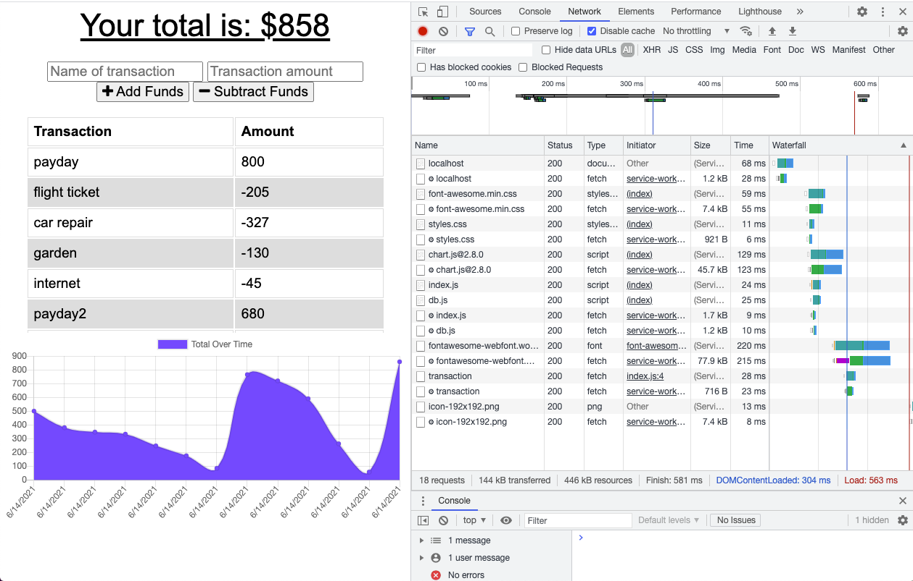
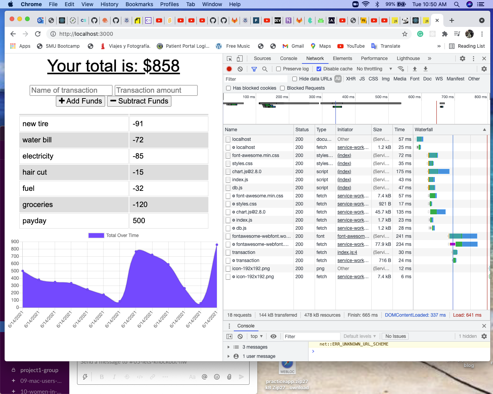
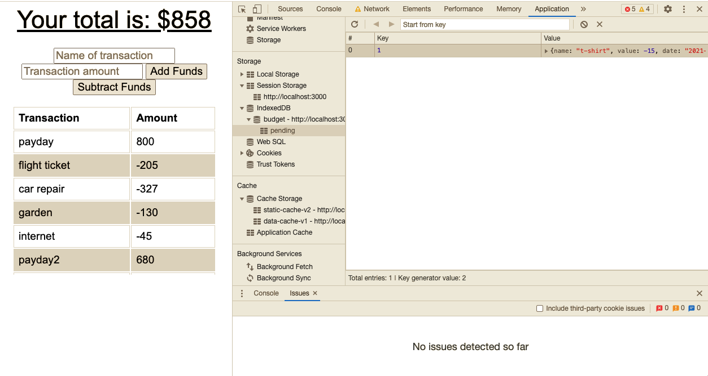
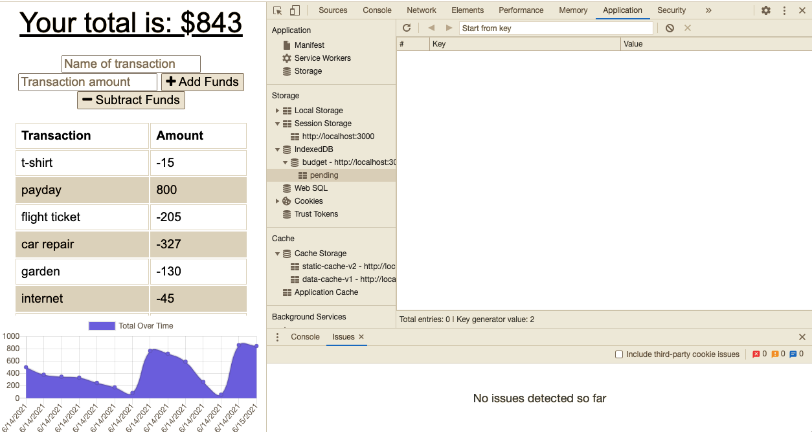

# Online-Offline-Budget-Tracker

# Description

A very useful app to keep track of a daily budget with or without internet connection. A user can add deposits and expenses, either online or offline, a balance of funds each transaction will generate to the functionality of the app. The user will have a better way to manage the money without internet connection.

# Deployment and Images

[Deployed Heroku app](https://evening-oasis-60943.herokuapp.com/)

# Technologies

- HTML
- CSS
- Bootstrap
- JQuery
- JavaScript
- Node.js
- Express
- MongoDB
- Mongoose
- Heroku

# resources

- MongoDB Website
- Robo 3T Website
- MongoJS Documentation
- Mongoose Documentation
- MongoDB for your Heroku NodeJS app documentation

# Contact

For questions and collaboration reach out to n_cerros@hotmail.com
